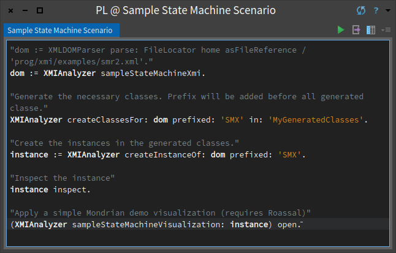
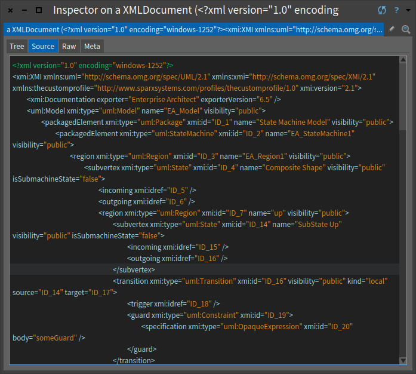
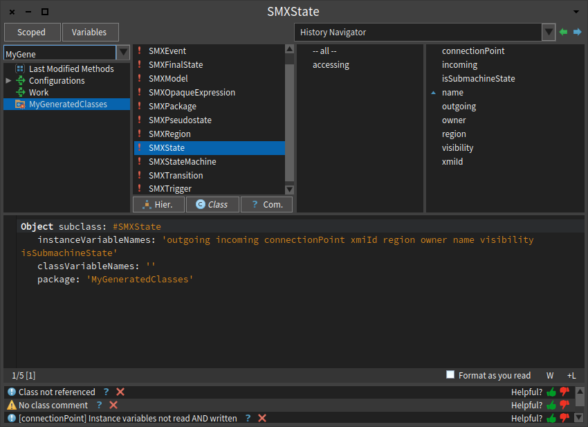
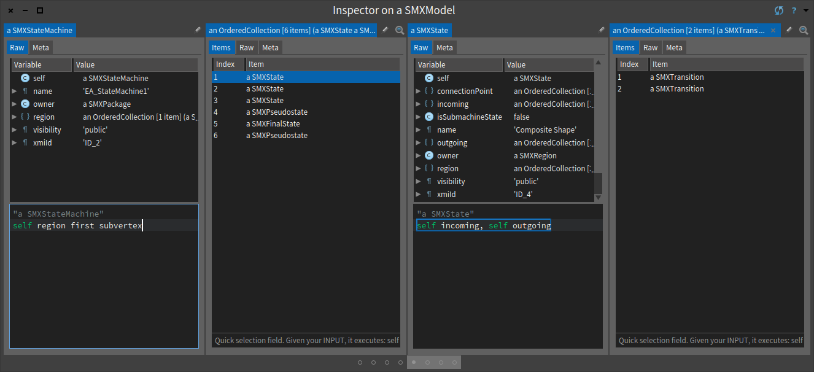
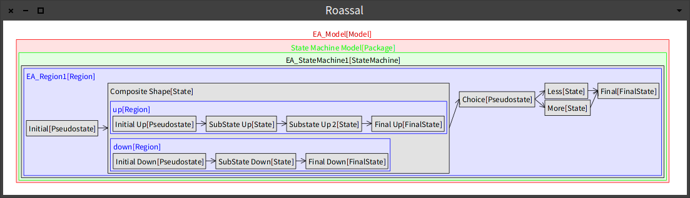

# XMI Analyzer [](https://travis-ci.org/peteruhnak/xmi-analyzer)

XMI Analyzer is a (prototype) utility assisting in analyzing XMI files (XMI \subset XML).

Instead of operating on the DOM this tool will generate appropriate classes for the individual node types and will instantiate them from the XMI.

The instantiation includes:

* basic type inference (booleans, numbers, strings, IDREF(s))
* reference resolution
	* instead of having string IDs in the DOM, the instances will have proper object references

## Example

In-image example is available after running `XMIAnalyzer>>exampleStateMachineScenario`

Example usage on some XMI:



Original XMI



Generated classes for the tree



Inspecting the instantiated model



Simple Roassal visualization of the content.



## Usage


"get an instance of DOM tree"
"dom := XMLDOMParser parse: FileLocator home asFileReference / 'prog/xmi/examples/smr2.xml'."
dom := XMIAnalyzer sampleStateMachineXmi.

"Generate the necessary classes. Prefix will be added before all generated classes."
XMIAnalyzer createClassesFor: dom prefixed: 'SMX' in: 'MyGeneratedClasses'.

"Create the instances in the generated classes."
instance := XMIAnalyzer createInstanceOf: dom prefixed: 'SMX'.

"Inspect the instance"
instance inspect.

"Apply a simple Mondrian demo visualization (requires Roassal)"
(XMIAnalyzer sampleStateMachineVisualization: instance) open.


## Installation

```
Metacello new
	baseline: 'XMIAnalyzer';
	repository: 'github://peteruhnak/xmi-analyzer/repository';
	load.
```
